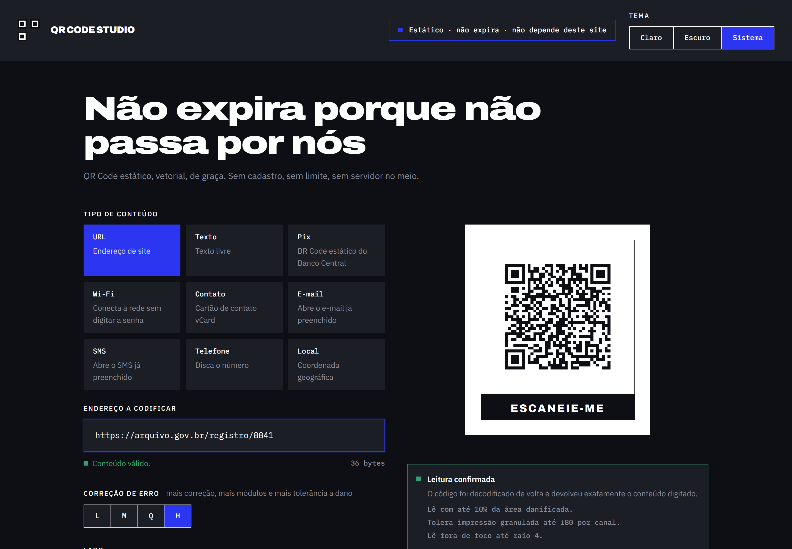
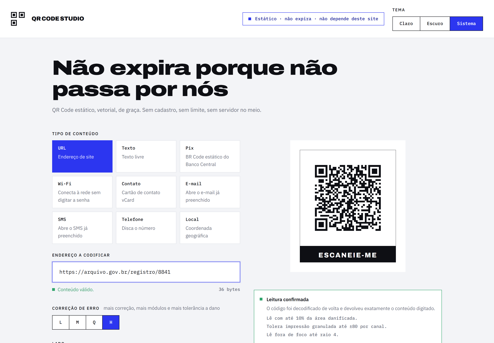
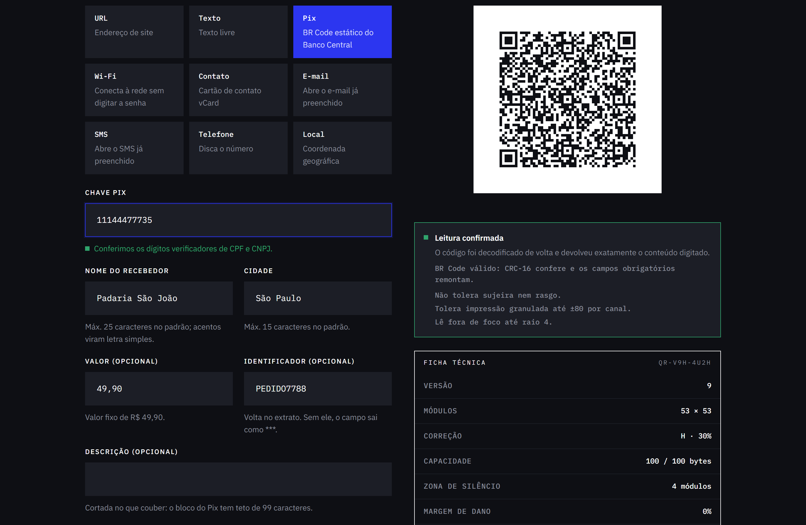
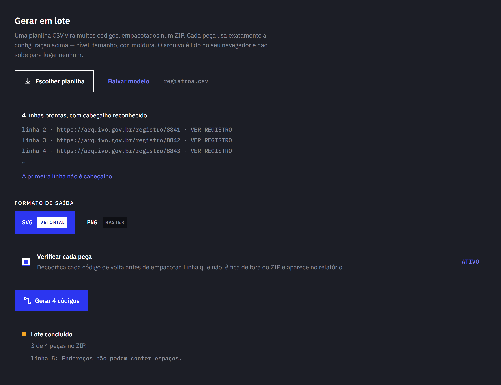

# QR Code Studio

**QR Codes nunca expiraram. Estavam te vendendo a data de validade.**

Gerador de QR Code estático e vetorial que roda inteiro no navegador. O que você digita nunca
sai da sua máquina, e o arquivo gerado continua funcionando mesmo que este site saia do ar —
não por promessa de política de privacidade, mas porque **não existe servidor no meio**. O site é
uma exportação estática, sem rota de API e sem banco, e há um teste E2E que intercepta toda
requisição de rede e falha se qualquer uma escapar da origem.



<details>
<summary>Modo claro</summary>



O tema é escolhido no cabeçalho — claro, escuro ou o do sistema — e a escolha sobrevive ao
recarregamento. **O código não inverte junto**: um QR claro sobre fundo escuro falha em parte dos
scanners, então só a interface muda. Há teste E2E cobrando isso.

</details>

---

## A tese

Um **QR estático** carrega o conteúdo dentro do próprio desenho de módulos. Os quadrados pretos e
brancos _são_ o endereço, e o leitor decodifica ali mesmo, no aparelho. Não existe servidor
intermediário e, por consequência, não existe nada para desligar. **Não pode expirar** — é uma
propriedade do formato, não um favor do serviço.

Um **QR dinâmico** codifica um link curto do domínio do provedor, que redireciona. É isso que
permite trocar o destino depois de imprimir, e é exatamente isso que permite desligar o código
quando a assinatura acaba. Os concorrentes pagos vendem dinâmico, muitas vezes sem deixar claro, e
frequentemente põem o download do estático atrás de paywall.

Este produto gera **exclusivamente QR estático**, e a consequência arquitetural é direta: nenhuma
rota de API, nenhum banco, nenhuma conta. Custo de operação zero é o que torna "de graça"
sustentável de verdade.

## O que ele faz

- **Nove tipos de conteúdo:** URL, texto, **Pix (BR Code)**, Wi-Fi, contato (vCard), e-mail, SMS,
  telefone e geolocalização.
- **Verificação automática de leitura:** o resultado renderizado é decodificado de volta e
  comparado com o original. Se não bater, a exportação é bloqueada.
- **Três saídas:** SVG e PDF vetoriais e PNG raster, todas geradas no navegador, com opções de
  gráfica — A4/Carta/Etiqueta, marcas de corte, sangria de 3 mm e preto 100% K.
- **14 molduras de impressão**, de rótulo simples a grade recortável e display de mesa.
- **Personalização** com indicador de contraste e logo central, com o teto de área medido.
- **Lote por CSV:** uma planilha vira centenas de códigos num ZIP, cada um verificado antes de
  entrar no pacote.
- **Histórico local** em IndexedDB, com a configuração inteira — cor, moldura, logo — restaurável
  com um clique.
- **Tema claro, escuro ou do sistema**, escolhido no cabeçalho e aplicado antes da primeira pintura.
- **Funciona offline** depois da primeira visita.

A ficha técnica traz versão, módulos, correção, ocupação, zona de silêncio e margem de dano, todos
calculados a partir da especificação ISO/IEC 18004 — nenhum deles decorativo.

## Números medidos

|                                     |                                                                                       |
| ----------------------------------- | ------------------------------------------------------------------------------------- |
| Lighthouse (home)                   | **91–94** performance · **100** acessibilidade · **100** boas práticas · **100** SEO  |
| JavaScript inicial                  | 220 KB com gzip — **zero** bytes de PDF, ZIP ou codificador de PNG                    |
| Chunk de PDF                        | 532 KB com gzip, baixado só no clique                                                 |
| SVG de um QR v8, 1.256 módulos      | 69,6 KB → **8,6 KB** com merge de runs, e **1 objeto no Illustrator em vez de 1.256** |
| Fontes embutidas no PDF             | 441 KB de TTF → **66 KB** depois de instanciar e subsetar                             |
| Margem de dano por oclusão, nível H | **10%** da área, medida por decodificação — não estimada                              |
| Testes                              | 369 de unidade e integração + 86 E2E em desktop e mobile                              |

A faixa do Lighthouse é a que cinco execuções seguidas produziram na mesma máquina, contra
`npm run preview` — que serve o `out/` de produção **com compressão**. Sem compressão o mesmo build
cai para 78, e o commit anterior a esta fase também: aquele número seria do servidor, não do código.
O procedimento está em [`docs/HANDOFF.md` §7](docs/HANDOFF.md).

## O diferencial: verificação por decodificação

Depois de aplicar cor, logo e moldura, a peça é rasterizada e **decodificada de volta**. Só isso já
separa o produto dos geradores que desenham e torcem.

O diagnóstico vai além. Quando a leitura falha, o sistema roda **experimentos controlados**: remove
o logo e tenta de novo; devolve as cores ao padrão e tenta de novo; aumenta a escala e tenta de
novo. O primeiro que faz o código voltar a ler não é palpite — é a causa isolada por eliminação, e a
interface diz isso explicitamente.

Polaridade invertida é checada antes de tudo, sem experimento: inverter as duas cores mantém a razão
de contraste **idêntica**, então nenhum teste de cor a distinguiria.

### O que isso descobriu

O limite de logo que o mercado publica está errado. Medido com jsQR e ZXing, que concordaram em
24 de 24 casos:

| Nível de correção | 10% | 16%   | 20% | 25%   |
| ----------------- | --- | ----- | --- | ----- |
| L                 | ✗   | ✗     | ✗   | ✗     |
| M                 | ✓   | ✗     | ✗   | ✗     |
| Q                 | ✓   | ✗     | ✗   | ✗     |
| **H**             | ✓   | **✓** | ✓   | **✗** |

O "25% da área com correção H" repetido por todo gerador **não passa em nenhum dos dois
decodificadores**. Ele confunde 30% de recuperação de _codewords_ com 30% de _área_, ignorando que
uma oclusão central concentra o dano em blocos contíguos. Aqui o teto é 16%, com margem sobre o
limite real de ~20%.

## Pix, o formato que mais combina com a tese



Um **BR Code estático** carrega chave, nome e cidade do recebedor dentro do próprio desenho. Não há
redirecionamento nem consulta a servidor — o aplicativo do banco lê os campos ali mesmo. Um Pix
dinâmico, por contraste, codifica uma URL que o banco precisa consultar, e essa URL pode ser
desligada.

O payload segue o **EMV-MPM** do Banco Central: blocos TLV fechados por um CRC-16. Três detalhes que
derrubam implementações de primeira viagem, cada um travado em teste:

- **CRC-16/CCITT-FALSE**, não outro dos cinco checksums que atendem por "CCITT". O vetor canônico
  `0x29B1` para `123456789` separa a variante certa das outras quatro.
- O checksum cobre o payload **incluindo o cabeçalho `6304` do próprio campo de CRC**.
- O **ponto de iniciação não é emitido**: ele só é obrigatório quando vale `12`, "use uma vez", que é
  a marca de um código dinâmico.

Os dígitos verificadores de CPF e CNPJ são conferidos — inclusive pela regra alfanumérica que passou
a valer em julho de 2026. Uma chave com um dígito trocado geraria um QR perfeitamente legível para um
destino que não existe, e o erro só apareceria na hora de pagar.

E há um **segundo nível de verificação**: além de decodificar o desenho de volta, o BR Code é
remontado a partir do TLV e o CRC conferido. Decodificar prova que a string sobreviveu ao desenho;
remontar prova que a string é um Pix válido. São dois defeitos diferentes, e nenhum cobre o outro.

## Lote por CSV



Uma planilha com uma coluna de conteúdo — e, opcionalmente, nome de arquivo e chamada de ação — vira
um ZIP com todas as peças, na configuração que está na tela.

O que sustenta isso é a arquitetura, não um caminho paralelo: **o lote chama a mesma função que
alimenta a prévia**. Não existe uma segunda implementação da composição que pudesse divergir.

Cada linha é decodificada de volta antes de entrar no pacote. A que não lê fica de fora e aparece no
relatório com o número da linha na planilha — é o defeito que ninguém descobre antes da impressão.

## Como rodar

```bash
npm install
npm run dev          # http://localhost:3000
```

```bash
npm run check        # typecheck + lint + formatação + 369 testes + build
npm run test:e2e     # 86 testes contra o export estático
npm run preview      # serve out/ na 4173, com compressão
```

Requer Node 22+. O `.npmrc` do projeto é essencial: sem ele o npm cai num registry que devolve 404
em `jsqr` e `pdf-lib`.

## Como funciona

```
formulário ──▶ /core/content ──▶ payload ──▶ /core/qr ──▶ QrArtifact ──┐
 (9 tipos)                                                              │
                                                                        ├──▶ /core/frames ──▶ Scene
                                    estilo, moldura, chamada ───────────┘   (14 funções puras)
                                                                                    │
                                              ┌─────────────────────────────────────┤
                                              ▼            ▼          ▼             ▼
                                            SVG          PNG        PDF        raster puro
                                              │                                     │
                                        /core/batch                      /core/verify
                                       (CSV → ZIP)                    decodifica de volta
```

Cada camada ignora a seguinte, e é isso que mantém o lado de dentro testável:

| Camada          | Responsabilidade             | Não sabe                  |
| --------------- | ---------------------------- | ------------------------- |
| `/core/content` | formulário → payload         | que existe QR             |
| `/core/qr`      | payload → matriz + metadados | que existe desenho        |
| `/core/frames`  | matriz + estilo → cena       | que existe SVG ou PDF     |
| `/core/render`  | cena → arquivo               | como a cena foi montada   |
| `/core/verify`  | cena → veredito              | que existe interface      |
| `/core/batch`   | configuração + CSV → ZIP     | como uma peça é desenhada |

### As decisões que mais importaram

**Uma display list entre composição e desenho.** 14 molduras × 3 formatos seriam 42 implementações
que precisariam concordar pixel a pixel. Com uma `Scene` intermediária em milímetros, cada moldura é
escrita **uma vez** como função pura e os renderers viram um `switch` sem regra de negócio. A
divergência entre formatos deixa de ser um risco a mitigar: some por construção.

**Entre conteúdo e código passa só uma string.** Um QR carrega texto; o que faz a câmera abrir a
rede Wi-Fi é a convenção de formato dentro desse texto. Por isso os nove tipos moram num diretório
só, e o décimo não tocará em nenhum renderer, na verificação nem no lote.

**Milímetro como unidade base, não pixel.** O produto existe para impressão; "1024 px" só significa
alguma coisa depois de escolhido o DPI.

**Rasterizador puro, sem canvas.** É o que permite a suíte de ida e volta rodar no Node — e esse
teste é o argumento central do produto. O mesmo rasterizador serve o lote, que por isso também roda
sem DOM, dentro de um Web Worker.

**Fontes do PDF embutidas, não servidas.** Um `fetch`, mesmo da própria origem, abriria um caminho
de rede num produto cuja tese é que nada sai do navegador.

**IndexedDB para o histórico, não `localStorage`.** Uma configuração com logo embutido é um `data:`
URI de centenas de KB, e o teto de 5 MB estoura em poucas entradas.

Detalhes em [`docs/ARQUITETURA.md`](docs/ARQUITETURA.md).

## Testes que valem menção

- **Ida e volta** — gerar, compor, rasterizar, decodificar e comparar com a entrada, nos quatro
  níveis de correção, nas 14 molduras e nos nove tipos de conteúdo.
- **Equivalência do merge** — o `<path>` mesclado cobre exatamente os mesmos módulos que um retângulo
  por módulo, verificado por comparação de conjuntos e por rasterização contra uma segunda
  implementação.
- **Geometria do PDF** — o fluxo de conteúdo é lido de volta e a matriz reconstruída, o que prova que
  o PDF desenha o código certo sem precisar de um rasterizador de PDF.
- **Vetores canônicos** — `crc16('123456789') === 0x29B1` para o Pix e `crc32(…) === 0xCBF43926` para
  o ZIP e o PNG. São o que separa a variante certa das homônimas.
- **ZIP e PNG lidos de volta** — o ZIP é percorrido pelo diretório central e descomprimido; o PNG tem
  os chunks conferidos por CRC, o IDAT inflado e os pixels comparados. Nenhum dos dois passa por "o
  arquivo abre".
- **Orientação da matriz** — o módulo escuro do ISO/IEC 18004 ancora a convenção `(coluna, linha)`.
  A matriz transposta é um QR espelhado que jsQR e ZXing leem sem reclamar, e só falha em parte dos
  celulares.
- **Rede zero** — fluxo completo de exportação, PDF e lote sem uma requisição fora da origem.
- **`border-radius: 0`** — varredura do DOM computado.

## Correções ao material de origem

O brand board é autoritativo para decisões visuais, mas alguns números dele não sobreviveram à
conferência — e um produto cuja tese é honestidade técnica não pode reproduzir um valor impossível:

- **`CAPACIDADE 1.782 / 2.303 bytes` para versão 6 nível H** não existe. O teto do formato em H é
  1.273 bytes, e em v6/H são 58.
- **`18,4 : 1` de contraste para Carbon sobre branco** — pela fórmula WCAG 2.x o valor é 19,14.
- **Steel `#6E7280` como texto secundário nos dois modos** não passa em AA: 4,36:1 sobre Quiet e
  3,99:1 sobre Carbon, contra o mínimo de 4,5:1. Ajustado por tema mantendo o matiz.
- **Ultramarine como texto sobre fundo escuro** dá 2,64:1. Serve em texto pequeno, mas só sobre claro.

A mesma armadilha quase se repetiu por dentro: a ficha exibia o tamanho do texto contra a capacidade
em modo Byte, e um Pix de 132 caracteres aparecia como **"132 / 98 bytes"**. O codificador escolhe
modos mais densos por segmento, então as duas pontas mediam coisas diferentes. Hoje a linha compara
bits ocupados contra bits disponíveis, com duas guardas em teste.

## Documentação

| Arquivo                                      | O que tem                                                   |
| -------------------------------------------- | ----------------------------------------------------------- |
| [`docs/HANDOFF.md`](docs/HANDOFF.md)         | **Comece aqui.** Estado, decisões, armadilhas e como medir  |
| [`docs/ARQUITETURA.md`](docs/ARQUITETURA.md) | As camadas, as fronteiras e por que cada uma está onde está |
| [`docs/PLANO.md`](docs/PLANO.md)             | O plano técnico da refatoração — registro histórico         |
| [`docs/ROADMAP.md`](docs/ROADMAP.md)         | O que faria sentido depois e as dívidas conhecidas          |

## Tecnologias

Next 16 (App Router, `output: 'export'`) · React 19 · TypeScript strict · Tailwind 4 ·
[`qrcode`](https://github.com/soldair/node-qrcode) para a matriz ·
[`jsqr`](https://github.com/cozmo/jsQR) para a verificação · `pdf-lib` + `@pdf-lib/fontkit` para o
PDF · Vitest · Playwright

Pix, CSV, ZIP e PNG são implementações próprias — cada uma justificada em
[`docs/ARQUITETURA.md`](docs/ARQUITETURA.md). Sem analytics, sem telemetria, sem script de terceiros.
As fontes são auto-hospedadas pelo `next/font` justamente por isso.

## Licença

MIT. As fontes Archivo e IBM Plex estão sob SIL Open Font License 1.1.

Desenvolvido por **[Igor de Castro](https://www.linkedin.com/in/igor-cferreira/)**.
